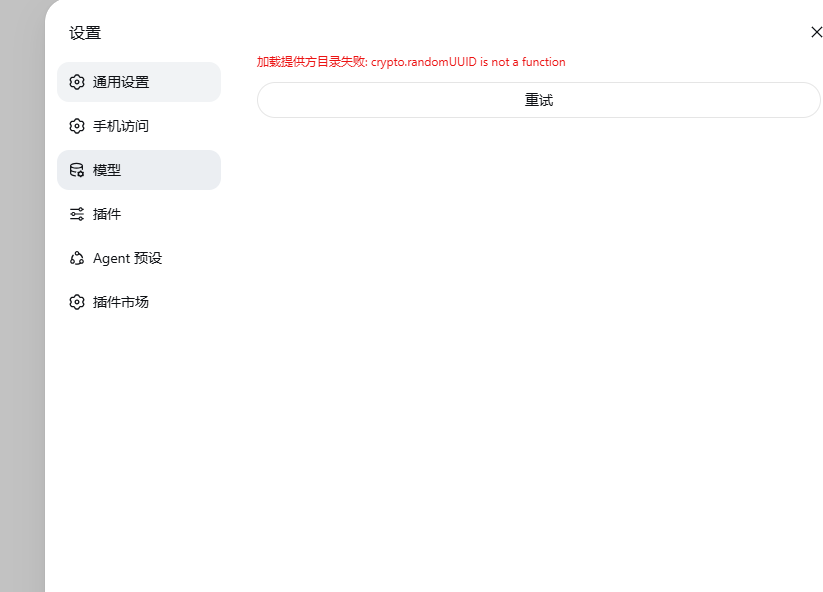
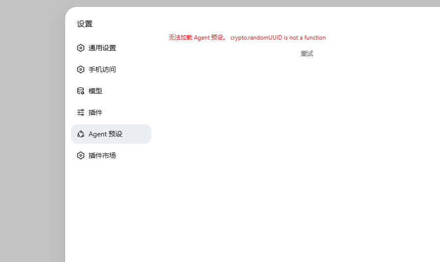
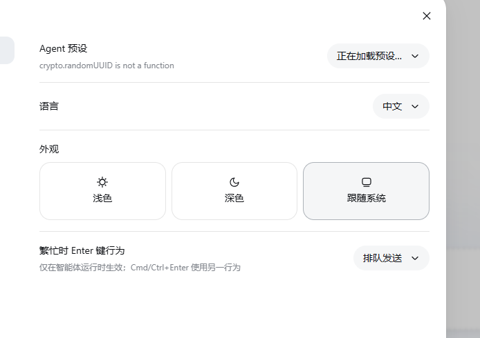
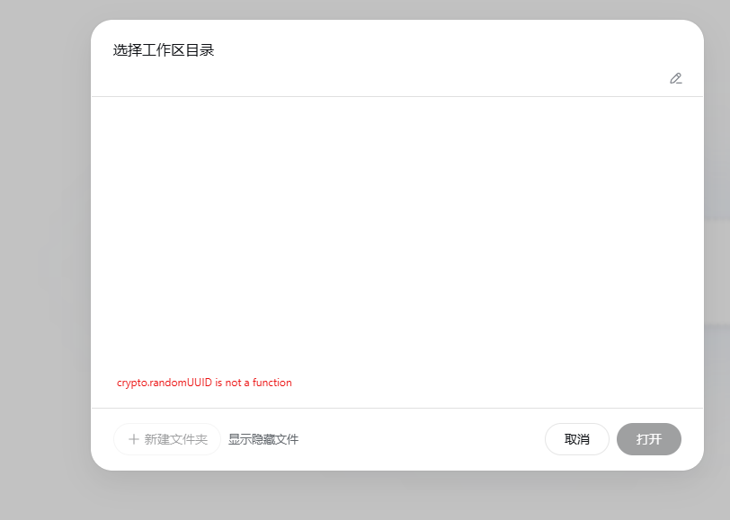

# dsh-ip-https

DeepSeek Harness 插件：远程浏览器能改设置，并用 Let’s Encrypt **IP 证书**做 HTTPS。不需要域名、不用备案、没有登录。

装完不用再手写 nginx。本插件不改 dsh 源码，也不改它安装目录里的文件。

公网打开后，谁能访问地址，谁就能改模型和在工作区跑命令。请自己用安全组 / VPN 限制来源。

## 做什么

1. **远程设置**：往页面注入脚本，让设置页按本机模式写入 `settings.yaml`。
2. **改头**：把 `Host` / `Origin` 改成 `127.0.0.1:<dsh端口>`，特权 RPC 和 pocket 的 `tunnel.start` 不再 403。
3. **自动 HTTPS**：探测公网 IP，申请 Let’s Encrypt `shortlived` IP 证书（约 6 天），80 跳 443，到期前约 48 小时自动续。

## 未装插件时

公网用 `http://<IP>:<端口>` 打开（不是 HTTPS、也不是本机），浏览器没有安全上下文，`crypto.randomUUID` 不可用，设置页和工作区会直接报错：

**模型加载失败**



**Agent 预设加载失败**





**选择工作区目录失败**



装上本插件后走 `https://<公网IP>/`，并注入 polyfill，这些页面可以正常打开、远程改设置。

## 安装 / 更新

需要已经能跑的 `dsh`（Node 22.5+），以及本机 `openssl`（生成带 IP SAN 的 CSR）。80/443 要对公网开放（安全组 + 防火墙）。

从任意 DeepSeek Harness 安装：

```bash
dsh plugin --profile web add dsh-ip-https
```

或更新插件 `dsh-ip-https`：

```bash
dsh plugin --profile web update dsh-ip-https@latest
```

然后启动网页界面。无需构建，也无需额外重启：

```bash
dsh web
```

启动后看终端里的 `dsh-ip-https URL`（没有 nginx 时用这一行）。已经用 nginx 反代 IP 的，继续打开原来的地址即可。

## 已经有 nginx、用 IP 访问时

**不用改 nginx。** 装上插件，还用原来的 `http://<公网IP>/`（或你在 nginx 里配的那个 IP 地址）。

插件在 dsh 进程里做两件事，流量即使是 nginx → `127.0.0.1:3080` 也会生效：

1. 注入脚本：补上 `crypto.randomUUID`，并让设置页按本机模式写入
2. 改 `Host` / `Origin`：特权 RPC 不再 403

因为 80/443 已被 nginx 占用，本插件**签不了** `https://<公网IP>/` 那种 IP 证书。HTTPS 仍由你现有的 nginx 负责（有就有，没有就还是 HTTP，但设置页可以工作）。

想改用插件自己的 `https://<公网IP>/`：让 nginx 不要占 80/443，再重启 `dsh`。

在 profile 的 `cordis.patch.yml` 里可改：

| 项 | 默认 | 含义 |
|---|---|---|
| `listenHost` | `0.0.0.0` | 网关监听地址 |
| `httpsPort` | `443` | HTTPS |
| `httpPort` | `80` | ACME + 跳转 |
| `fallbackPort` | `3443` | 443 被占时的后备端口 |
| `autoTls` | `true` | 自动申请 IP 证书 |
| `publicIp` | 空 | 留空则自动探测 |
| `acmeEmail` | 空 | 可选，到期通知 |
| `acmeStaging` | `false` | `true` 走 LE 测试环境 |

设置页解锁用的是页面注入，不是改 dsh 的 `client.js`。dsh 大版本如果改了模块加载器，需要升级本插件。
